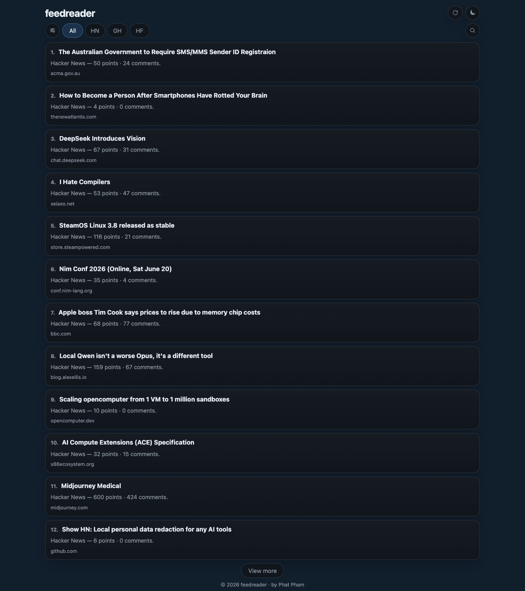

# feedreader

<p align="center">
  <strong>A tiny, fast, self-hosted feed reader for engineering and research signals.</strong>
</p>

<p align="center">
  Server-rendered UI · SQLite storage · Scheduled refresh · Docker-friendly · Private by default
</p>

<p align="center">
  
  
  
  
</p>

---

## Screenshot



---

## Features

- **Multi-source feed aggregation**
  - Hacker News
  - GitHub Trending
  - Hugging Face Papers Trending
  - alphaXiv Explore
- **Persistent local storage** with SQLite
- **Incremental fetch model** that keeps older items in the database
- **Server-backed incremental loading**: first page loads 12 items, first-load bootstrap/filter/search/refresh show a toast-based loading state, and `View more` appends more items in place
- **Source-aware card summaries**
  - Hacker News cards show **points** and **comments**
  - GitHub cards show **stars**, **today's stars**, and **forks**
  - Hugging Face cards show **upvotes**
  - alphaXiv cards show **likes**
- **Responsive, minimalist UI** with:
  - source filters
  - real source icons in filters, dialog rows, and card metadata
  - RSS-based app icon/favicon branding
  - dark/light mode
  - inline expanding search
  - refresh control
  - source configuration dialog
- **Configurable visible sources** stored in `localStorage`
  - choose which source buttons are shown
  - when 2+ sources are enabled, `All` stays visible and aggregates over the enabled set
  - when exactly 1 source is enabled, only that source button is shown
- **Debounced client-side search UX** backed by the server API
- **Explicit empty states** for no-result source filters and searches
- **Connectivity toasts** for internet disconnect/reconnect events
- **Scheduled refresh** every 3 hours on wall-clock boundaries in UTC+7
- **Manual refresh** from the UI updates the current feed list in place without a full page reload and shows a toast-based loading state while refresh + refetch are running
- **Persisted visited-link dimming** for feed card titles across reload/reopen using local storage
- **PWA-ready assets and offline caching** including manifest, service worker, touch icons, cached shell assets, and cached `/api/items` responses for previously visited views
- **Reconnect list refresh** re-fetches the current view from backend stored items only; it does **not** refresh upstream sources
- **Docker deployment** with reverse-proxy-friendly HTTP service

---

## Why feedreader?

`feedreader` is designed for people who want a small, understandable, self-hosted reader instead of a large feed platform.

It optimizes for:

- simple operations
- low memory usage
- straightforward data ownership
- easy extension when adding more sources

---

## Tech stack

### Backend

- Go
- `net/http`
- `html/template`
- `modernc.org/sqlite`
- `goquery`

### Frontend

- Server-rendered HTML
- Vanilla JavaScript
- Plain CSS

### Storage

- SQLite

### Deployment

- Docker
- Reverse proxy compatible

---

## Architecture

At a high level:

1. source adapters fetch upstream content
2. items are upserted into SQLite by `(source, external_id)`
3. the web app reads stored items ordered by article date descending
4. the scheduler refreshes on 3-hour clock boundaries

Key properties:

- old items are retained in the database
- fetch failures do not wipe existing data
- sources without a native article date fall back to the initial fetch time (`first_seen_at`) for ordering
- later refreshes preserve the original published/fetched ordering timestamps for existing items

---

## Project structure

```text
cmd/feedreader/         CLI entrypoint
internal/config/        configuration loading
internal/db/            SQLite bootstrap and pragmas
internal/domain/        domain models
internal/repository/    persistence layer
internal/service/       refresh orchestration and scheduler
internal/sources/       upstream source adapters
internal/web/           HTTP handlers and page rendering
web/templates/          HTML templates
web/static/             CSS, JS, icons, PWA assets
docs/assets/            README screenshots and supporting images
```

Host-level implementation notes for this deployment live at:

- `~/.hermes/implementations/2026-06-18_feedreader-service-implementation.md`

---

## Getting started

### Prerequisites

- Go 1.24+ for local builds
- or Docker for containerized usage

### Run locally

```bash
go run ./cmd/feedreader serve --host 0.0.0.0 --port 8080
```

Then open:

- `http://127.0.0.1:8080`

### Manual refresh

```bash
go run ./cmd/feedreader fetch
```

### Docker build

```bash
docker build -t feedreader .
```

### Docker run

```bash
docker run --rm -p 8080:8080 -v $(pwd)/data:/data feedreader
```

Then open:

- `http://127.0.0.1:8080`

---

## Configuration

Environment variables:

| Variable                             |                Default | Description                                                    |
| ------------------------------------ | ---------------------: | -------------------------------------------------------------- |
| `FEEDREADER_DB_PATH`                 | `./data/feedreader.db` | SQLite database path                                           |
| `FEEDREADER_REFRESH_INTERVAL_HOURS`  |                    `3` | Refresh interval setting used by the scheduler                 |
| `FEEDREADER_ITEMS_PER_SOURCE`        |                   `20` | Per-source item count used in source dashboard/health contexts |
| `FEEDREADER_REQUEST_TIMEOUT_SECONDS` |                   `20` | Upstream request timeout                                       |
| `FEEDREADER_USER_AGENT`              |       `feedreader/0.1` | Outbound fetch user agent                                      |
| `FEEDREADER_HOST`                    |              `0.0.0.0` | HTTP bind host                                                 |
| `FEEDREADER_PORT`                    |                 `8080` | HTTP bind port                                                 |

---

## Scheduling

The scheduler runs **inside the app process**.

Behavior:

- aligned to **UTC+7** (`Asia/Ho_Chi_Minh`)
- runs on the next **3-hour wall-clock boundary**
- does **not** perform an immediate refresh just because the container starts

Manual refresh is also available through the UI and CLI.

---

## API

### `GET /healthz`

Returns service health and per-source refresh status.

### `GET /api/items`

Returns feed items for incremental loading.

Query params:

- `source` — optional source filter (`hackernews`, `github`, `huggingface`, `alphaxiv`)
- `sources` — optional comma-separated aggregate source set used when the client wants the `All` view scoped to enabled sources (for example `hackernews,github`)
- `q` — optional case-insensitive search query across title, summary, author, URL host/path, and stored metadata
- `limit` — page size
- `offset` — pagination offset

---

## Data model

The service stores a cumulative feed history.

Each fetch:

- upserts items by `(source, external_id)`
- updates refresh state in `sync_state`
- preserves older items already in the database

The UI/API render items from the full stored set, ordered by article date descending.

Presentation-layer note:

- the source adapters persist raw metadata into `metadata_json`
- the card-building layer turns that metadata into user-visible summary lines
- current rendered metrics are:
  - Hacker News: points and comments
  - GitHub: stars, today, forks
  - Hugging Face Papers: upvotes
  - alphaXiv: likes
- source icons are not embedded in the brief text itself
- the current card layout renders the real source icon inline before the host/domain line

---

## UI behavior

### Search

- the search control expands inline in the header
- clicking the search icon focuses the input
- the input renders at `16px` to avoid common iOS Safari auto-zoom behavior
- typing is debounced before hitting the API
- closing the search control clears the query and resets the feed

### Loading and empty states

- first-load bootstrap queries, source filter changes, searches, `View more`, and manual refresh all show an explicit toast-based loading state
- source-filter and search requests that return zero items replace the list with an empty-state message instead of leaving stale cards on screen
- `View more` disables itself while an append request is in flight and hides itself when the current result set has no further page

### Offline and connectivity

- the app shell and previously fetched `GET /api/items` views are cached by the service worker for offline reuse
- this offline/PWA behavior requires a secure-context origin where service workers are available (for example `localhost` or HTTPS); plain HTTP network IP origins such as `http://100.94.224.102:9002` do not get service-worker-based offline reopen support on iOS
- when the browser goes offline, a no-wifi indicator appears before the refresh button instead of showing connectivity toasts
- if an offline view has no cached `/api/items` response yet, the list is replaced with `Offline and no cached items are available for this view yet.`
- when the browser comes back online, the no-wifi indicator disappears and the current view is re-fetched silently from `/api/items`
- reconnect refreshes backend-stored items only; the only UI path that calls `POST /api/refresh` remains the manual refresh button

### Source configuration

- the configure button opens a dialog that lets the user choose visible sources
- selected sources are stored in `localStorage` under `feedreader.sources`
- source-specific filters render as **real icon-only buttons**
- `All` remains a text button
- the source dialog renders **real source icons** before each source name
- if **2 or more** sources are enabled, the filter bar shows:
  - `All`
  - each enabled source
- if **exactly 1** source is enabled, the filter bar shows only that source
- the `All` view aggregates only over the enabled source set, not over disabled sources

---

## Roadmap

Potential next improvements:

- more sources (blogs, changelogs, newsletters, papers)
- server-side pagination
- source weighting and ranking controls
- source-specific parsing tests with fixtures
- export/import support

---

## Contributing

Contributions are welcome.

A good contribution flow:

1. fork the repository
2. create a branch
3. make changes
4. run formatting and tests
5. open a pull request

Example local verification:

```bash
gofmt -w $(find . -name "*.go")
go test ./...
```

---

## Repository hygiene

The SQLite runtime data directory is intentionally ignored:

```gitignore
data/
```

This keeps the repository focused on source code and assets.
